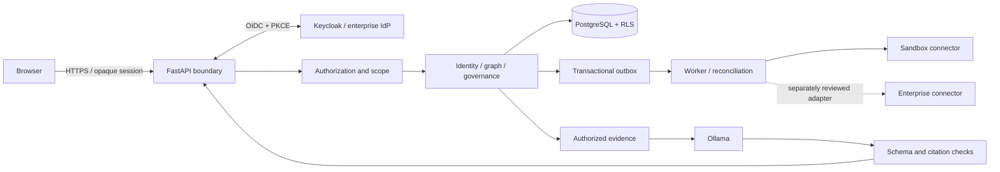

# Architecture

All components below are proposed.



Browser, imported content and model output are untrusted. API is the sole public business interface. Workers reauthorize actions. Database, worker, model and IdP administration stay private. Network destinations are server configuration, never source/model instructions.

Modules: inventory; graph/effective access; findings; reviews/approval/JIT/JML/policy; history; investigation; labs; connectors; reports; administration. Shared infrastructure provides authorization, audit, transactions, jobs, evidence, clock and IDs. Modules expose contracts rather than bypassing domain invariants.

Reads resolve session → membership → capability/resource scope → retrieval → deterministic calculation → evidence-backed result. Include versions, timestamps, coverage and completeness. Caches include organization, environment, authorization scope, graph version and query; reauthorize hits.

Writes create a canonical proposal. Simulation binds targets, source versions, graph snapshot, policy version, parameters and expiry into a digest. Independent human approval requires recent MFA. Execution rechecks all bindings and connector capabilities. Domain state, audit intent and outbox commit together. Worker uses idempotency and confirms source outcome before reporting success.

External changes cannot share a local transaction. Timeouts require reconciliation; partial outcomes remain explicit. Compensation is a new authorized action and may be impossible for deletion or credential revocation. Never automatically restore privilege as rollback.

## Proposed repository

```text
apps/web/src/          routes, features, design tokens
apps/api/app/          HTTP, sessions, domain modules
apps/worker/           jobs and reconciliation
packages/contracts/   generated types and schemas
packages/fixtures/    synthetic versioned Contoso data
connectors/            contracts and sandbox adapters
migrations/            SQL and RLS
tests/                 unit, integration, API, security, E2E
infra/                 future packaging and operations
docs/                  plans, agents, screenshots, videos
```

Product directories are planned, not scaffolded. Local deployment will use Compose: web/proxy, API, worker, PostgreSQL, Keycloak; optional Ollama. Production requires TLS, key management, restricted egress, backups/restore drills, monitoring and separate runtime/migration roles.

Initial unverified benchmark targets: 10,000 identities, 100,000 edges, 10 concurrent investigators; bounded graph p95 below 2 seconds on a documented reference machine. Longer requests become cancellable jobs. Proposed pilot recovery objectives: RPO 24 hours, RTO 4 hours; production requirements need owner review.

## Primary references

Runtime database roles must not own tables or bypass RLS: [PostgreSQL row security](https://www.postgresql.org/docs/current/ddl-rowsecurity.html). Authentication uses standard flows: [Keycloak OIDC](https://www.keycloak.org/securing-apps/oidc-layers). Output schemas constrain shape, not truth: [Ollama structured outputs](https://github.com/ollama/ollama/blob/main/docs/capabilities/structured-outputs.mdx).
